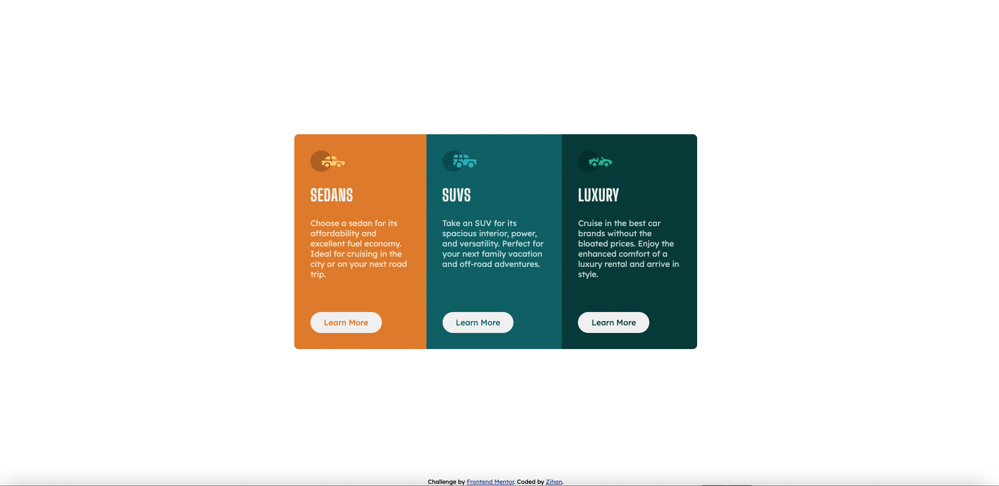
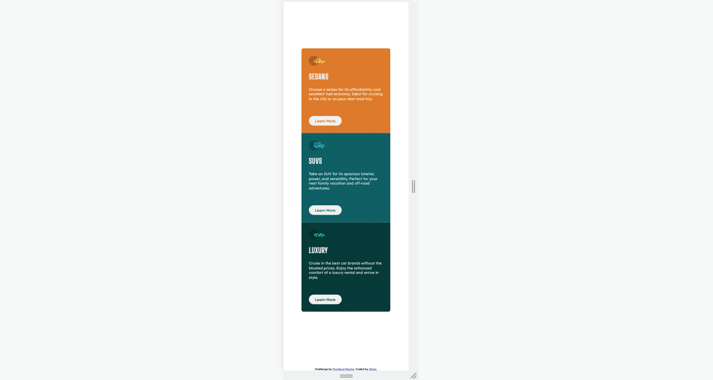

# Frontend Mentor - 3-column preview card component solution

This is a solution to the [3-column preview card component challenge on Frontend Mentor](https://www.frontendmentor.io/challenges/3column-preview-card-component-pH92eAR2-). Frontend Mentor challenges help you improve your coding skills by building realistic projects.

## Table of contents

- [Frontend Mentor - 3-column preview card component solution](#frontend-mentor---3-column-preview-card-component-solution)
  - [Table of contents](#table-of-contents)
  - [Overview](#overview)
    - [The challenge](#the-challenge)
    - [Screenshot](#screenshot)
    - [Links](#links)
  - [My process](#my-process)
    - [Built with](#built-with)
    - [What I learned](#what-i-learned)
    - [Continued development](#continued-development)
    - [Useful resources](#useful-resources)
  - [Author](#author)
  - [Acknowledgments](#acknowledgments)

## Overview

### The challenge

Users should be able to:

- View the optimal layout depending on their device's screen size
- See hover states for interactive elements

### Screenshot




### Links

- Solution URL: [Solution](https://github.com/zhao-zihan/frontend-mentor-practices/tree/main/3-column-preview-card-component-main)
- Live Site URL: [Live site](https://3-column-preview-card-component-07-25.netlify.app/)

## My process

### Built with

- Semantic HTML5 markup
- CSS custom properties
- Flexbox
- CSS Grid
- Desktop-first workflow

### What I learned

1. inherit background color

   ```css
   background-color: inherit;
   ```

2. border inside element when hovering

   ```css
   .btn:hover {
     box-shadow: inset 0 0 0 2px hsl(0, 0%, 95%);
   }
   ```

3. use same class names for components with exactly same styles
4. use absolute positioning to make buttons fixed
5. shrink elements before the border of screen sizes, in this case the predefined smaller screen size is 375px, but media query triggers at 500px so the contents wouldn't go off.

### Continued development

### Useful resources

- [Udemy omnifood project](https://omnifood-zzh.netlify.app/) - This includes good examples on using border inside element and media queries setup. Check [this repo](https://github.com/zhao-zihan/html-css-course-master-study-notes/tree/main/starter/07-Omnifood-Desktop) for detailed codes.

## Author

- Website - [3-column-preview-card-component-07-25](https://3-column-preview-card-component-07-25.netlify.app/)
- Github - [@zhao-zihan](https://github.com/zhao-zihan)

## Acknowledgments
