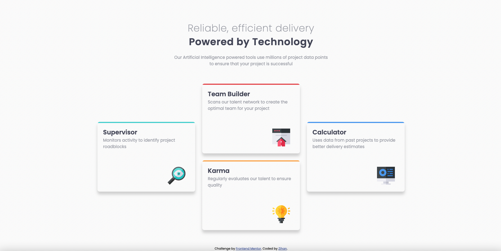
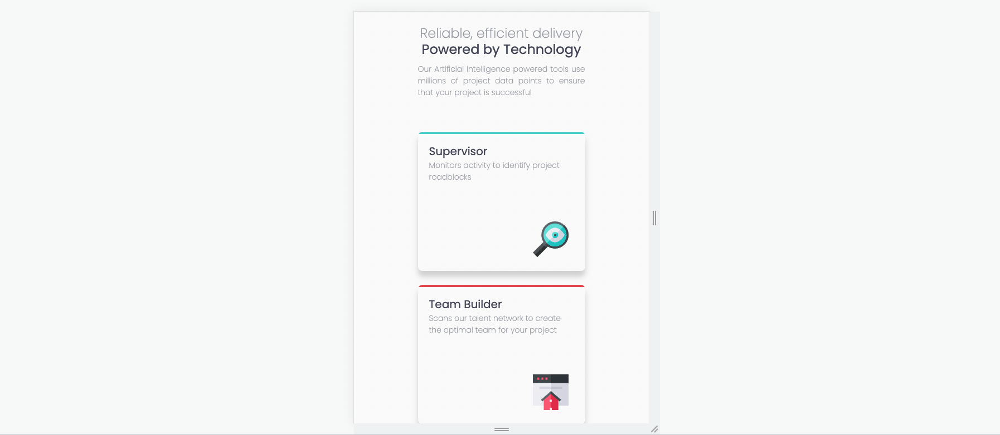
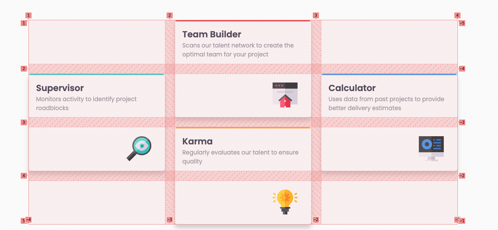

# Frontend Mentor - Four card feature section solution

This is a solution to the [Four card feature section challenge on Frontend Mentor](https://www.frontendmentor.io/challenges/four-card-feature-section-weK1eFYK). Frontend Mentor challenges help you improve your coding skills by building realistic projects.

## Table of contents

- [Frontend Mentor - Four card feature section solution](#frontend-mentor---four-card-feature-section-solution)
  - [Table of contents](#table-of-contents)
  - [Overview](#overview)
    - [The challenge](#the-challenge)
    - [Screenshot](#screenshot)
    - [Links](#links)
  - [My process](#my-process)
    - [Built with](#built-with)
    - [What I learned](#what-i-learned)
    - [Continued development](#continued-development)
    - [Useful resources](#useful-resources)
  - [Author](#author)
  - [Acknowledgments](#acknowledgments)

## Overview

### The challenge

Users should be able to:

- View the optimal layout for the site depending on their device's screen size

### Screenshot




### Links

- Solution URL: [Solution](https://github.com/zhao-zihan/frontend-mentor-practices/tree/main/four-card-feature-section-master)
- Live Site URL: [Live site](https://four-card-feature-section-master-07-29.netlify.app/)

## My process

### Built with

- Semantic HTML5 markup
- CSS custom properties
- Flexbox
- CSS Grid
- Desktop-first workflow

### What I learned

1. how to create straight border with border radius

   ```css
   .card {
     border-radius: 8px;
     position: relative;
     overflow: hidden;
   }

   .supervisor:before {
     content: "";
     position: absolute;
     top: 0;
     left: 0;
     right: 0;
     border-top: 4px solid hsl(180, 62%, 55%);
     z-index: 1;
   }
   ```

2. use pseudo elements to create light wrapper

   ```css
   .supervisor:before {
     content: ""; /* content is necessary */
     position: absolute;
     top: 0;
     left: 0;
     right: 0;
     border-top: 4px solid hsl(180, 62%, 55%);
     z-index: 1;
   }
   ```

3. the flexibility of grid  
   

### Continued development

### Useful resources

- [How to get a border-bottom line with rounded corner](https://stackoverflow.com/questions/52872079/how-to-get-a-border-bottom-line-with-rounded-corner) - Amazing answer on how to create straight borders with border radius.

## Author

- Github - [@zhao-zihan](https://github.com/zhao-zihan)

## Acknowledgments
