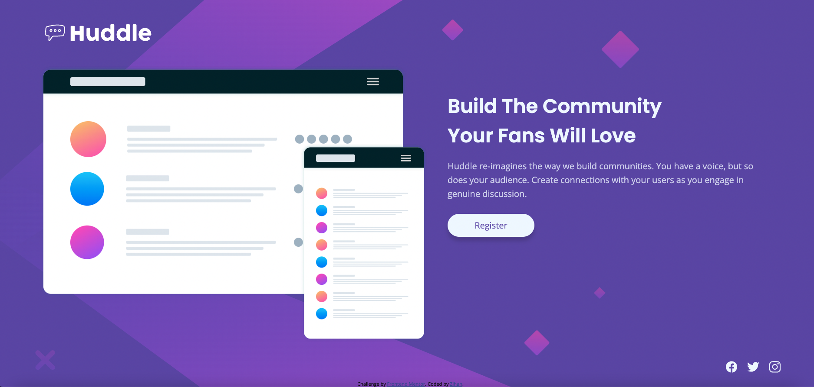
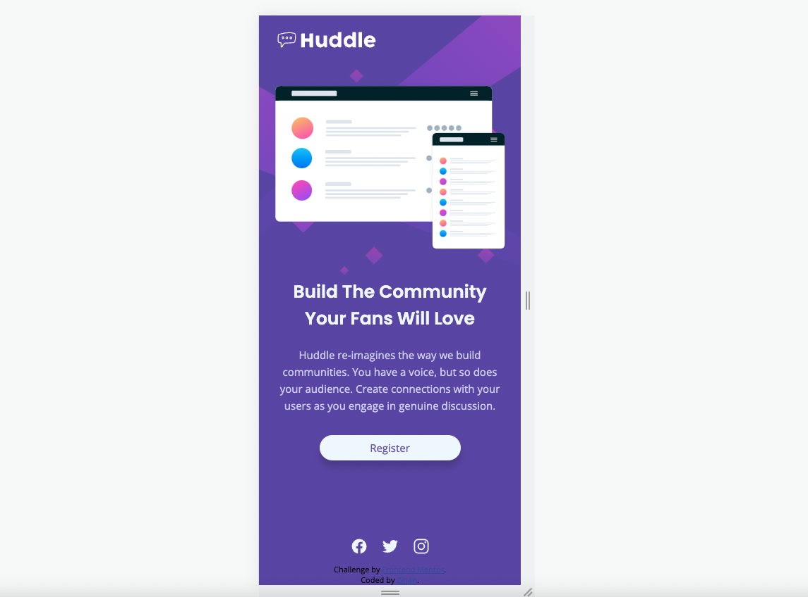
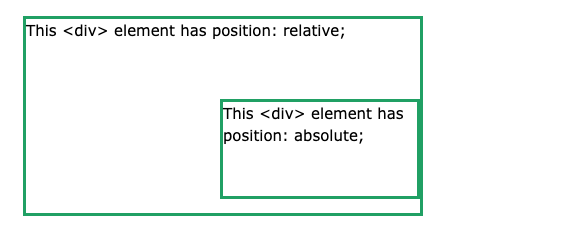

# Frontend Mentor - Huddle landing page with single introductory section solution

This is a solution to the [Huddle landing page with single introductory section challenge on Frontend Mentor](https://www.frontendmentor.io/challenges/huddle-landing-page-with-a-single-introductory-section-B_2Wvxgi0). Frontend Mentor challenges help you improve your coding skills by building realistic projects.

## Table of contents

- [Frontend Mentor - Huddle landing page with single introductory section solution](#frontend-mentor---huddle-landing-page-with-single-introductory-section-solution)
  - [Table of contents](#table-of-contents)
  - [Overview](#overview)
    - [The challenge](#the-challenge)
    - [Screenshot](#screenshot)
    - [Links](#links)
  - [My process](#my-process)
    - [Built with](#built-with)
    - [What I learned](#what-i-learned)
    - [Continued development](#continued-development)
    - [Useful resources](#useful-resources)
  - [Author](#author)
  - [Acknowledgments](#acknowledgments)

## Overview

### The challenge

Users should be able to:

- View the optimal layout for the page depending on their device's screen size
- See hover states for all interactive elements on the page

### Screenshot




### Links

- Solution URL: [Solution](https://github.com/zhao-zihan/frontend-mentor-practices/tree/main/huddle-landing-page-with-single-introductory-section-master)
- Live Site URL: [Live site](https://huddle-landing-page-master-07-31.netlify.app/)

## My process

### Built with

- Semantic HTML5 markup
- CSS custom properties
- Flexbox
- CSS Grid
- Desktop-first workflow

### What I learned

1. practiced more on grid layout and absolute positioning, and remember, absolute positioned content are positioned relative to the nearest positioned ancestor

   

   ```css
   div.relative {
     position: relative;
     width: 400px;
     height: 200px;
     border: 3px solid #73ad21;
   }

   div.absolute {
     position: absolute;
     top: 80px;
     right: 0;
     width: 200px;
     height: 100px;
     border: 3px solid #73ad21;
   }
   ```

2. reinforced on how to structure a social media pool

   

   ```html
   <ul class="social-media">
     <li>
       <a class="footer-link" href="#">
         <ion-icon class="social-icon" name="logo-facebook"></ion-icon>
       </a>
     </li>
     <li>
       <a class="footer-link" href="#"
         ><ion-icon class="social-icon" name="logo-twitter"></ion-icon
       ></a>
     </li>
     <li>
       <a class="footer-link" href=""
         ><ion-icon class="social-icon" name="logo-instagram"></ion-icon
       ></a>
     </li>
   </ul>
   ```

### Continued development

### Useful resources

- [CSS Layout - The position Property](https://www.w3schools.com/css/css_positioning.asp) - Just some quick reminders of how absolute positioning works.
- [Giving background-color to body applying whole page. Why?](https://stackoverflow.com/questions/44300463/giving-background-color-to-body-applying-whole-page-why) - Tells you why and where we should alter the background color property, the answer is inside the `BODY` selector.
- [Anchor or button](https://stackoverflow.com/questions/18314019/anchor-or-button) - In short, use anchor for navigation or links, use buttons for quick actions.

## Author

- Github - [@zhao-zihan](https://github.com/zhao-zihan)

## Acknowledgments
