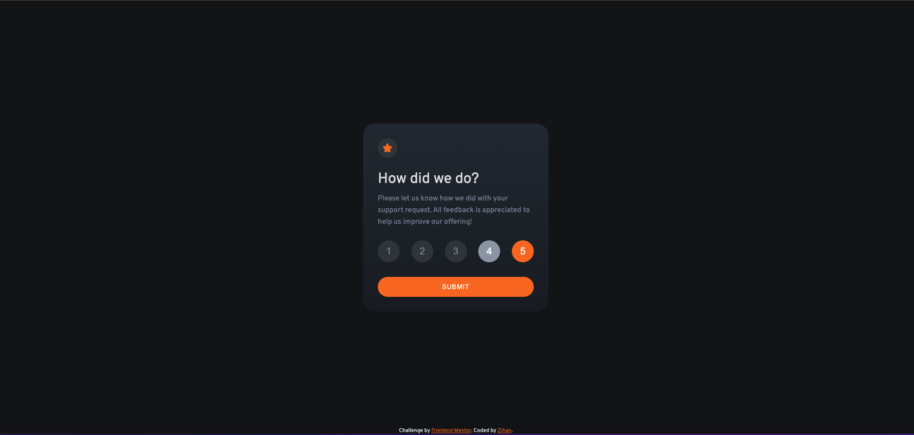
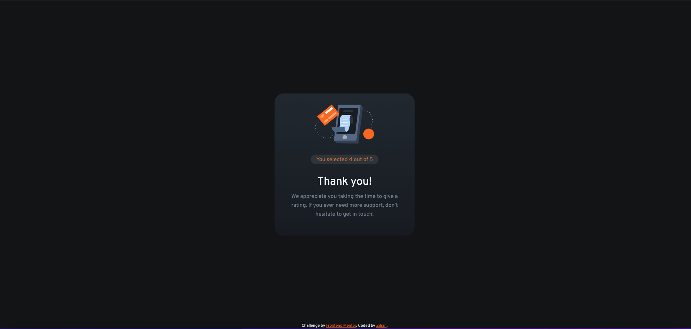

# Frontend Mentor - Interactive rating component solution

This is a solution to the [Interactive rating component challenge on Frontend Mentor](https://www.frontendmentor.io/challenges/interactive-rating-component-koxpeBUmI). Frontend Mentor challenges help you improve your coding skills by building realistic projects.

## Table of contents

- [Frontend Mentor - Interactive rating component solution](#frontend-mentor---interactive-rating-component-solution)
  - [Table of contents](#table-of-contents)
  - [Overview](#overview)
    - [The challenge](#the-challenge)
    - [Screenshot](#screenshot)
    - [Links](#links)
  - [My process](#my-process)
    - [Built with](#built-with)
    - [What I learned](#what-i-learned)
    - [Continued development](#continued-development)
    - [Useful resources](#useful-resources)
  - [Author](#author)
  - [Acknowledgments](#acknowledgments)

## Overview

### The challenge

Users should be able to:

- View the optimal layout for the app depending on their device's screen size
- See hover states for all interactive elements on the page
- Select and submit a number rating
- See the "Thank you" card state after submitting a rating

### Screenshot




### Links

- Solution URL: [Solution](https://github.com/zhao-zihan/frontend-mentor-practices/tree/main/interactive-rating-component-main)
- Live Site URL: [Live site](https://interactive-rating-component-main-08-01.netlify.app/)

## My process

### Built with

- Semantic HTML5 markup
- CSS custom properties
- Flexbox
- CSS Grid
- Mobile-first workflow
- Vanilla JavaScript

### What I learned

1. use of !important keyword, maybe a bad practice but effective

   ```css
   .selected-rating {
     background-color: hsl(217, 12%, 63%) !important;
     color: hsl(0, 0%, 100%) !important;
   }

   .hidden {
     display: none !important;
   }
   ```

2. how to create modal window
   ```css
   .modal {
     position: absolute;
     top: 0;
     left: 0;
     width: 100%;
     height: 100%;
     background-image: inherit;
     padding: inherit;
     border-radius: inherit;
     display: flex;
     flex-direction: column;
     align-items: center;
     text-align: center;
   }
   ```
3. always turn on strict mode at the very top to enable all the fancy new features without worrying to trigger any wired bugs
   ```js
   "use strict";
   ```
4. select all the elements create all the functions you need on top of the script file to make your code organized

5. use for loops to add eventlistener to all elements

   ```js
   const removeRating = function () {
     for (let i = 0; i < ratingsEl.length; i++) {
       ratingsEl[i].classList.remove("selected-rating");
     }
   };
   ```

6. this keyword always refer to the object who's calling the function

   ```js
   currentRating = +this.textContent;
   ```

7. when removing from a classlist, type in full class name without the dot in front

   ```js
   // not .hidden
   modalEl.classList.remove("hidden");
   ```

8. very important, how to distinguish event
   ```js
   // to allow users to unselect current rating by clicking the background
   window.addEventListener("mousedown", function (e) {
     const isClickedInside = e.target == submitEl;
     if (!isClickedInside) {
       removeRating();
     }
   });
   ```

### Continued development

### Useful resources

- [complete-javascript-course](https://github.com/zhao-zihan/complete-javascript-course-master) - Check out folder 05, 06, 07.
- [click background](https://codepen.io/anon/pen/OKMNEy) - This codepen teaches you how to set event listener for clicking your specific targeting areas.

## Author

- Github - [@zhao-zihan](https://github.com/zhao-zihan)

## Acknowledgments
