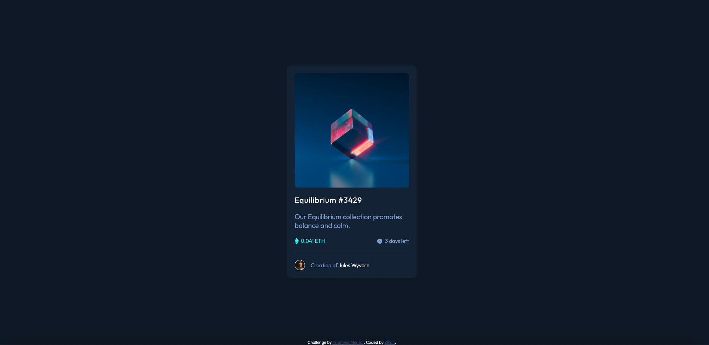

# Frontend Mentor - NFT preview card component solution

This is a solution to the [NFT preview card component challenge on Frontend Mentor](https://www.frontendmentor.io/challenges/nft-preview-card-component-SbdUL_w0U). Frontend Mentor challenges help you improve your coding skills by building realistic projects.

## Table of contents

- [Frontend Mentor - NFT preview card component solution](#frontend-mentor---nft-preview-card-component-solution)
  - [Table of contents](#table-of-contents)
  - [Overview](#overview)
    - [The challenge](#the-challenge)
    - [Screenshot](#screenshot)
    - [Links](#links)
  - [My process](#my-process)
    - [Built with](#built-with)
    - [What I learned](#what-i-learned)
    - [Continued development](#continued-development)
    - [Useful resources](#useful-resources)
  - [Author](#author)
  - [Acknowledgments](#acknowledgments)

## Overview

### The challenge

Users should be able to:

- View the optimal layout depending on their device's screen size
- See hover states for interactive elements

### Screenshot



### Links

- Solution URL: [Solution](https://github.com/zhao-zihan/frontend-mentor-practices/tree/main/nft-preview-card-component-main)
- Live Site URL: [Live site](https://nft-preview-card-07-24.netlify.app/)

## My process

### Built with

- HTML5
- CSS
- Flexbox
- CSS Grid

### What I learned

1. proper way to set 100vh

   ```css
   html {
     height: -webkit-fill-available; /* We have to fix html height */
   }

   body {
     min-height: 100vh;
     min-height: -webkit-fill-available;
   }
   ```

2. create overlay icon effect

   ```html
   <div class="container">
     
     <div class="overlay">
       <a href="#" class="icon" title="User Profile">
         <i class="fa fa-user"></i>
       </a>
     </div>
   </div>
   ```

   ```css
   /* Container needed to position the overlay. Adjust the width as needed */
   .container {
     position: relative;
     width: 100%;
     max-width: 400px;
   }

   /* Make the image to responsive */
   .image {
     width: 100%;
     height: auto;
   }

   /* The overlay effect (full height and width) - lays on top of the container and over the image */
   .overlay {
     position: absolute;
     top: 0;
     bottom: 0;
     left: 0;
     right: 0;
     height: 100%;
     width: 100%;
     opacity: 0;
     transition: 0.3s ease;
     background-color: red;
   }

   /* When you mouse over the container, fade in the overlay icon*/
   .container:hover .overlay {
     /* use rgba to create semi-transparent background */
     opacity: 1;
   }

   /* The icon inside the overlay is positioned in the middle vertically and horizontally */
   .icon {
     color: white;
     font-size: 100px;
     position: absolute;
     top: 50%;
     left: 50%;
     transform: translate(-50%, -50%);
     -ms-transform: translate(-50%, -50%);
     text-align: center;
   }

   /* When you move the mouse over the icon, change color */
   .fa-user:hover {
     color: #eee;
   }
   ```

3. make square image round

   ```css
   .creator-img {
     border-radius: 50%;
     border: 1px solid hsl(0, 0%, 100%);
   }
   ```

4. create bottom border line
   ```css
   border-bottom: 1px solid hsl(215, 32%, 27%);
   ```

### Continued development

### Useful resources

- [How TO - Image Overlay Icon](https://www.w3schools.com/howto/howto_css_image_overlay_icon.asp) - Teaches you how to create overlay icon effect.
- [Stretching body to full viewport height: the missing way](https://dev.to/fenok/stretching-body-to-full-viewport-height-the-missing-way-2ghd#:~:text=A%20height%20of%20100vh%20corresponds,height%20regardless%20of%20its%20content.) - Explains how to fix 100vh issues.

## Author

- Website - [nft-preview-card-07-24](https://nft-preview-card-07-24.netlify.app/)
- Github - [@zhao-zihan](https://github.com/zhao-zihan)

## Acknowledgments
