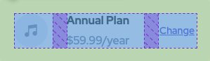

# Frontend Mentor - Order summary card solution

This is a solution to the [Order summary card challenge on Frontend Mentor](https://www.frontendmentor.io/challenges/order-summary-component-QlPmajDUj). Frontend Mentor challenges help you improve your coding skills by building realistic projects.

## Table of contents

- [Frontend Mentor - Order summary card solution](#frontend-mentor---order-summary-card-solution)
  - [Table of contents](#table-of-contents)
  - [Overview](#overview)
    - [The challenge](#the-challenge)
    - [Screenshot](#screenshot)
    - [Links](#links)
  - [My process](#my-process)
    - [Built with](#built-with)
    - [What I learned](#what-i-learned)
    - [Continued development](#continued-development)
    - [Useful resources](#useful-resources)
  - [Author](#author)
  - [Acknowledgments](#acknowledgments)

## Overview

### The challenge

Users should be able to:

- See hover states for interactive elements

### Screenshot


### Links

- Solution URL: [Solution](https://github.com/zhao-zihan/frontend-mentor-practices/tree/main/order-summary-component-main)
- Live Site URL: [order-summary-component-07-25](https://order-summary-component-07-25.netlify.app/)

## My process

### Built with

- Semantic HTML5 markup
- CSS custom properties
- Flexbox
- CSS Grid
- Desktop-first workflow

### What I learned

1. how to properly set background image

   ```css
   body {
     background-image: url("images/pattern-background-desktop.svg");
     background-repeat: repeat-x;
   }
   ```

2. grid & flex last element margin difference

   - flex

   
   

   - grid

   
   

3. use more transparent color for hovering effect
   
   

4. pre-shrink content before the critical point in media queries

### Continued development

### Useful resources

- [omnifood](https://omnifood-zzh.netlify.app/) - A good reference.

## Author

- Website - [order-summary-component-07-25](https://order-summary-component-07-25.netlify.app/)
- Github - [@zhao-zihan](https://github.com/zhao-zihan)

## Acknowledgments
