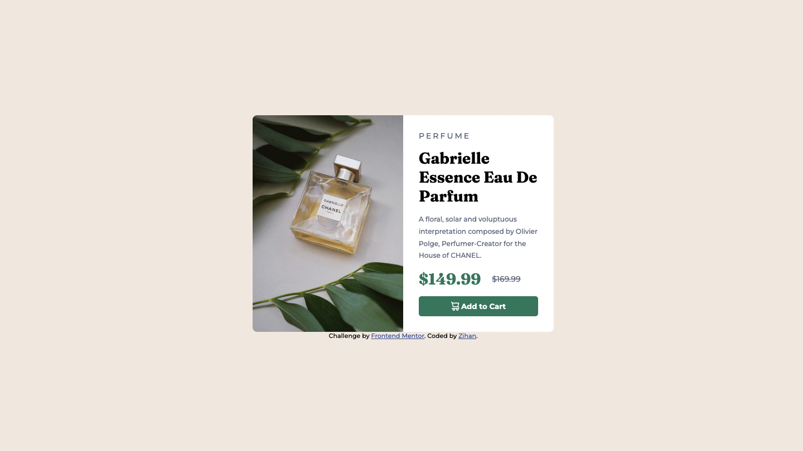

# Frontend Mentor - Product preview card component solution

This is a solution to the [Product preview card component challenge on Frontend Mentor](https://www.frontendmentor.io/challenges/product-preview-card-component-GO7UmttRfa). Frontend Mentor challenges help you improve your coding skills by building realistic projects.

## Table of contents

- [Frontend Mentor - Product preview card component solution](#frontend-mentor---product-preview-card-component-solution)
  - [Table of contents](#table-of-contents)
  - [Overview](#overview)
    - [The challenge](#the-challenge)
    - [Screenshot](#screenshot)
    - [Links](#links)
  - [My process](#my-process)
    - [Built with](#built-with)
    - [What I learned](#what-i-learned)
    - [Continued development](#continued-development)
    - [Useful resources](#useful-resources)
  - [Author](#author)
  - [Acknowledgments](#acknowledgments)

## Overview

### The challenge

Users should be able to:

- View the optimal layout depending on their device's screen size
- See hover and focus states for interactive elements

### Screenshot



### Links

- Solution URL: [solution code on Github](https://github.com/zhao-zihan/frontend-mentor-practices)
- Live Site URL: [live site](https://product-preview-component-07-22.netlify.app)

## My process

### Built with

- HTML5
- CSS
- Flexbox
- CSS Grid

### What I learned

1. global reset

   ```css
   * {
     padding: 0;
     margin: 0;
     box-sizing: border-box;
     font-family: "Montserrat", sans-serif;
   }
   ```

2. set font size

   ```css
   html {
     /* 16px * 0.625 = 10px */
     font-size: 62.5%;
   }

   body {
     /* default size: 14px */
     font-size: 1.4rem;
   }
   ```

- rem based on root font size
- em based on parent element font size
- font-size: rem
- width: % in combination with a max-width, ch
- height: question urself "do i rly need to set height" if yes -> use a min-height
- padding/margin: rem or em, kevin often uses em for padding of buttons
- media queries: em

3. center a div in viewport

   ```css
   body {
     display: grid;
     place-content: center;
     min-height: 100vh;
     /* vh = view height */
   }
   ```

4. hide image corners under border radius

   ```css
   .parent-container {
     overflow: hidden;
   }
   ```

5. create image box

   ```html
   <div class="image-box" role="img" aria-label="description"></div>
   ```

   ```css
   .image-box {
     background-image: url(images/image-product-desktop.jpg);
     background-size: cover;
     background-position: center;
   }
   ```

6. organize text box

   ```css
   /* grid */
   .text-box {
     display: grid;
     grid-template-columns: 1fr;
     /* use gap to create margins */
     gap: 1em;
   }

   /* flexbox */
   .text-box {
     display: flex;
     flex-direction: column;
     align-items: center;
     gap: 1em;
   }
   ```

7. create subheadings

   ```html
   <div class="subheading">perfume</div>
   <h1 class="heading">Gabrielle Essence Eau De Parfum</h1>
   ```

8. inline elements

   - have left / right paddings & margins
   - no top / bottom paddings or margins

9. button that auto align with other text

   ```css
   .btn,
   .btn:link,
   .btn:visited {
     display: flex;
     justify-content: center;
     align-items: center;
     text-decoration: none;
     border: none;
     background-color: hsl(158, 36%, 37%);
     color: hsl(0, 0%, 100%);
     border-radius: 5px;
     cursor: pointer;
     font-weight: 600;
     padding: 1rem;
   }

   .btn:hover,
   .btn:active {
     background-color: hsl(212, 21%, 14%);
   }
   ```

### Continued development

### Useful resources

- [Are you using the right CSS units?](https://www.youtube.com/watch?v=N5wpD9Ov_To) - Helped me understand which unit to use when defining different CSS properties and also why and hot to reset font sizes.
- [CSS em and rem explained](https://www.youtube.com/watch?v=_-aDOAMmDHI&t=420s) - Explains the difference between em and rem.

## Author

- Website - [Zihan](https://product-preview-component-07-22.netlify.app)
- Github - [@zhao-zihan](https://github.com/zhao-zihan)

## Acknowledgments

Special thanks to @celioFagundes
https://www.frontendmentor.io/solutions/htmlcssmobilefirst-Hxl7rhCkG7
