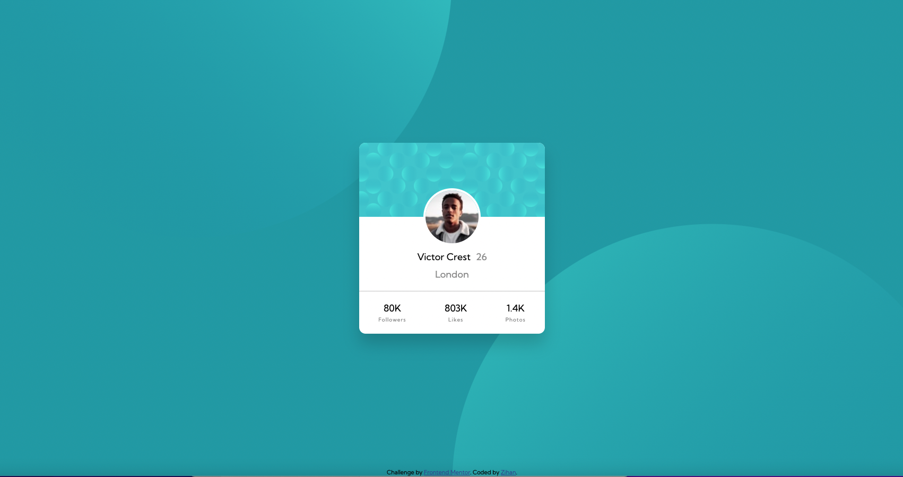
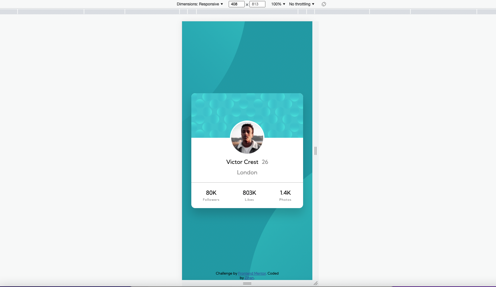
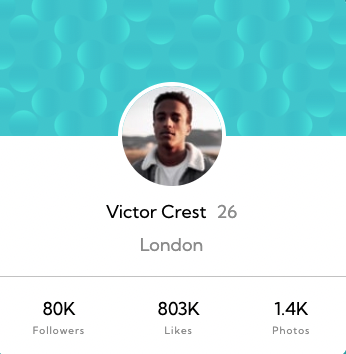
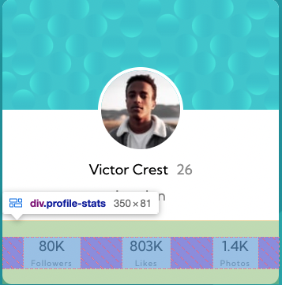

# Frontend Mentor - Profile card component solution

This is a solution to the [Profile card component challenge on Frontend Mentor](https://www.frontendmentor.io/challenges/profile-card-component-cfArpWshJ). Frontend Mentor challenges help you improve your coding skills by building realistic projects.

## Table of contents

- [Frontend Mentor - Profile card component solution](#frontend-mentor---profile-card-component-solution)
  - [Table of contents](#table-of-contents)
  - [Overview](#overview)
    - [The challenge](#the-challenge)
    - [Screenshot](#screenshot)
    - [Links](#links)
  - [My process](#my-process)
    - [Built with](#built-with)
    - [What I learned](#what-i-learned)
    - [Continued development](#continued-development)
    - [Useful resources](#useful-resources)
  - [Author](#author)
  - [Acknowledgments](#acknowledgments)

## Overview

### The challenge

- Build out the project to the designs provided

### Screenshot




### Links

- Solution URL: [Solution](https://github.com/zhao-zihan/frontend-mentor-practices/tree/main/profile-card-component-main)
- Live Site URL: [Live site](https://profile-card-component-07-26.netlify.app/)

## My process

### Built with

- Semantic HTML5 markup
- CSS custom properties
- Flexbox
- CSS Grid
- Desktop-first workflow

### What I learned

1. insert and position multiple background images

   ```css
   body {
     background-image: url(images/bg-pattern-top.svg),
       url(images/bg-pattern-bottom.svg);
     background-repeat: no-repeat, no-repeat;
     background-position: right 48vw bottom 50vh, left 50vw top 47vh;
   }
   ```

2. create crop image effect

   

   ```html
   <div class="text-box">
     
   </div>
   ```

   ```css
   .profile-photo {
     width: 10rem;
     border-radius: 50%;
     border: 4px solid #fff;
     margin-top: -54px;
   }
   ```

3. take a look at the space-around property

   

   ```css
   .profile-stats {
     width: 100%;
     display: flex;
     justify-content: space-around;
     text-align: center;
     border-top: 1px solid hsla(0, 0%, 59%, 0.514);
     padding: 2rem 0;
   }
   ```

4. different approach to center content using a wrapper div main and flex
   ```css
   main {
     display: flex;
     align-items: center;
     min-height: 100vh;
   }
   ```

### Continued development

### Useful resources

- [@SinaAgh's solution](https://github.com/SinaAgh/Profilecard) - This gus is amazing, love his idea on how to create the image crop effect and his using of space-around property.
- [CSS Positioning: Position absolute and relative explained](https://www.youtube.com/watch?v=P6UgYq3J3Qs) - Powell teaches you all you need to know about absolute positioning.

## Author

- Website - [Zihan](https://profile-card-component-07-26.netlify.app/)
- Github - [@zhao-zihan](https://github.com/zhao-zihan)

## Acknowledgments
