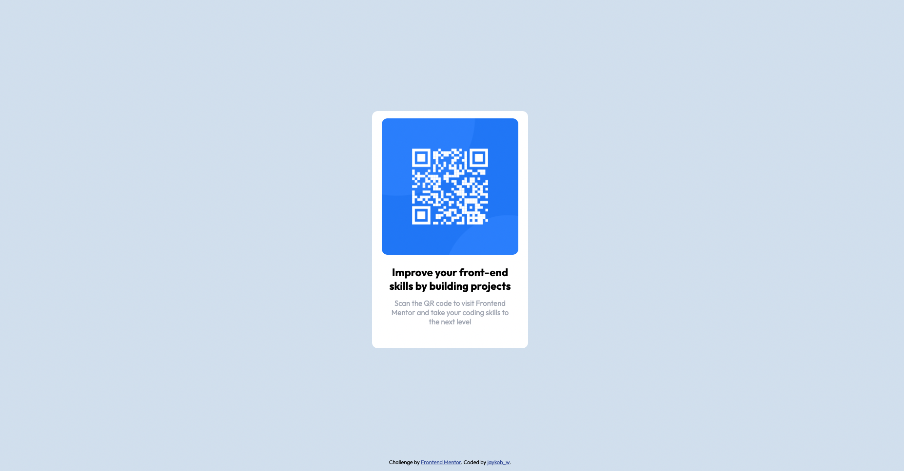

# Frontend Mentor - QR code component solution

This is a solution to the [QR code component challenge on Frontend Mentor](https://www.frontendmentor.io/challenges/qr-code-component-iux_sIO_H). Frontend Mentor challenges help you improve your coding skills by building realistic projects.

## Table of contents

- [Frontend Mentor - QR code component solution](#frontend-mentor---qr-code-component-solution)
  - [Table of contents](#table-of-contents)
  - [Overview](#overview)
    - [Screenshot](#screenshot)
    - [Links](#links)
  - [My process](#my-process)
    - [Built with](#built-with)
    - [What I learned](#what-i-learned)
    - [Continued development](#continued-development)
    - [Useful resources](#useful-resources)
  - [Author](#author)
  - [Acknowledgments](#acknowledgments)

## Overview

### Screenshot



### Links

- Solution URL: [Solution](https://github.com/zhao-zihan/frontend-mentor-practices/tree/main/qr-code-component-main)
- Live Site URL: [Live site](https://qr-code-component-07-23.netlify.app/)

## My process

### Built with

- HTML5
- CSS
- Flexbox
- CSS Grid

### What I learned

1. box-shadow review

   ```css
   /* offset-x ? offset-y ? blur-radius | color */
   box-shadow: 0 15px 15px rgba(0, 0, 0, 0.1);
   ```

2. width, max-width, min-width

   ```css
   .container {
     max-width: 28rem;
   }

   .code-img {
     max-width: 100%;
     height: auto;
     display: block;
   }
   ```

3. absolute position

   ```css
   /* position element to the bottom center of parent elem */
   .attribution {
     position: absolute;
     bottom: 0;
     left: 50%;
     /* offset-x | offset-y */
     transform: translate(-50%, 0);
   }
   ```

4. line break

   ```html
   <br />
   ```

5. center text

   ```css
   .text-box {
     text-align: center;
   }
   ```

6. think about the difference between using an img element vs using background image property with a div element

   ```html
   <div class="image-box">
     
   </div>

   <div
     class="image-box"
     role="img"
     aria-label="QR code with blue background"
   ></div>
   ```

7. Bonus - use figure tag to wrap images
   ```html
   <!-- add captions below the image -->
   <figure class="gallery">
     
     <figcaption>Caption</figcaption>
   </figure>
   ```

### Continued development

### Useful resources

- [CSS min-width, max-width, and width](https://www.youtube.com/watch?v=YjtunZW7jxw) - Explains differences between width, max-width, min-width, height, etc.
- [Why set img display block](https://codepen.io/anon/pen/gNeoQE) - This codepen example demonstrate why it is necessary to set img display to block.
- [Build Responsive Real-World Websites with HTML and CSS](https://www.udemy.com/course/design-and-develop-a-killer-website-with-html5-and-css3/learn/lecture/27513208#overview) - Episode 120 & 121 explains how to organize images with CSS grid.

## Author

- Website - [Zihan](https://qr-code-component-07-23.netlify.app/)
- GitHub - [@zhao-zihan](https://github.com/zhao-zihan)

## Acknowledgments
