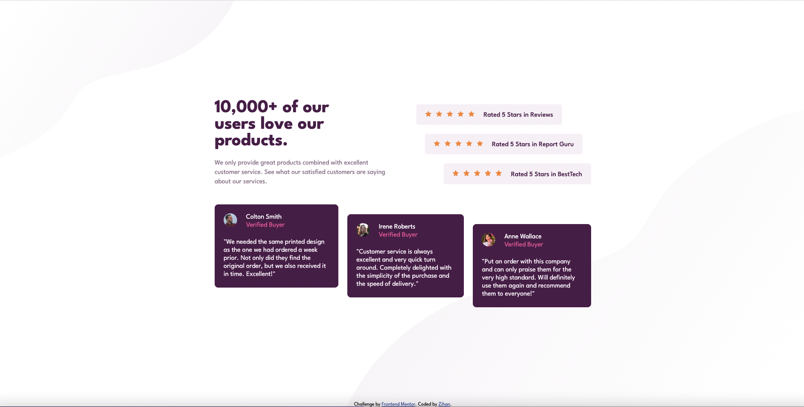
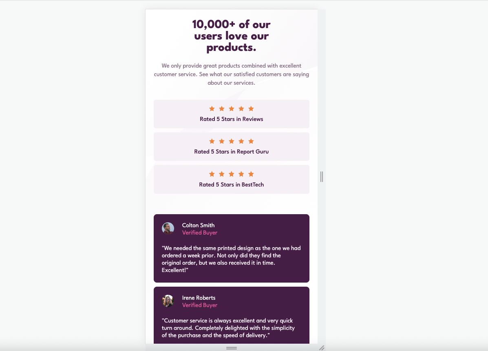
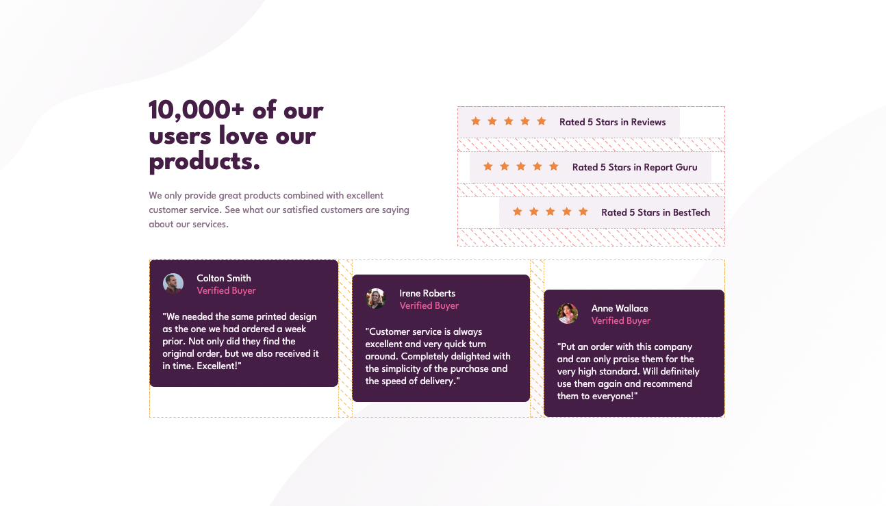

# Frontend Mentor - Social proof section solution

This is a solution to the [Social proof section challenge on Frontend Mentor](https://www.frontendmentor.io/challenges/social-proof-section-6e0qTv_bA). Frontend Mentor challenges help you improve your coding skills by building realistic projects.

## Table of contents

- [Frontend Mentor - Social proof section solution](#frontend-mentor---social-proof-section-solution)
  - [Table of contents](#table-of-contents)
  - [Overview](#overview)
    - [The challenge](#the-challenge)
    - [Screenshot](#screenshot)
    - [Links](#links)
  - [My process](#my-process)
    - [Built with](#built-with)
    - [What I learned](#what-i-learned)
    - [Continued development](#continued-development)
    - [Useful resources](#useful-resources)
  - [Author](#author)
  - [Acknowledgments](#acknowledgments)

## Overview

### The challenge

Users should be able to:

- View the optimal layout for the section depending on their device's screen size

### Screenshot




### Links

- Solution URL: [Solution](https://github.com/zhao-zihan/frontend-mentor-practices/tree/main/social-proof-section-master)
- Live Site URL: [Live site](https://social-proof-section-master-07-28.netlify.app/)

## My process

### Built with

- Semantic HTML5 markup
- CSS custom properties
- Flexbox
- CSS Grid
- Desktop-first workflow

### What I learned

1. new way to center content using flex

   ```css
   .parent {
     display: flex;
   }
   .child {
     margin: auto;
   }
   ```

2. know well about align and justify properties, remember to create enough space by setting parent container size much bigger than individual items

   

   ```css
   .ratings li:nth-child(1) {
     align-self: flex-start;
   }
   .ratings li:nth-child(2) {
     align-self: center;
   }
   .ratings li:nth-child(3) {
     align-self: flex-end;
   }

   .testimonials .testimonial:nth-child(1) {
     align-self: flex-start;
   }
   .testimonials .testimonial:nth-child(2) {
     align-self: center;
   }
   .testimonials .testimonial:nth-child(3) {
     align-self: flex-end;
   }
   ```

3. grid column row properties review

   ```css
   .mission {
     grid-column: 1;
   }
   .ratings {
     grid-column: 2;
     grid-row: 1 / span 2;
   }
   ```

4. simpler way to position background images
   ```css
   body {
     background-image: url("images/bg-pattern-top-desktop.svg"),
       url("images/bg-pattern-bottom-desktop.svg");
     background-repeat: no-repeat, no-repeat;
     background-position: left 0 top 0, right 0 bottom 0;
     min-height: 100vh;
     min-height: -webkit-fill-available;
   }
   ```

### Continued development

### Useful resources

- [A Complete Guide to Flexbox](https://css-tricks.com/snippets/css/a-guide-to-flexbox/) - Check out the flexbox properties and examples section.
- [A Complete Guide to Grid](https://css-tricks.com/snippets/css/complete-guide-grid/) - Check out the grid properties section.

## Author

- Website - [Zihan](https://social-proof-section-master-07-28.netlify.app/)
- Github- [@zhao-zihan](https://github.com/zhao-zihan)

## Acknowledgments
