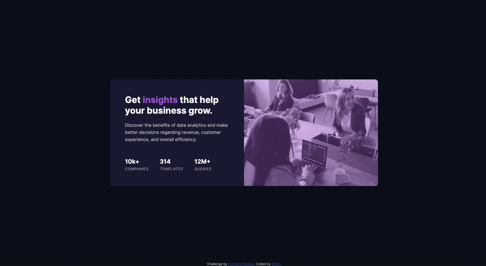
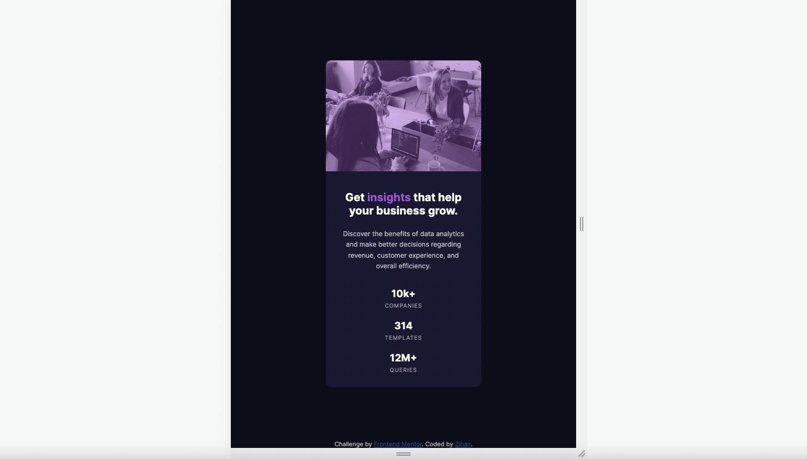

# Frontend Mentor - Stats preview card component solution

This is a solution to the [Stats preview card component challenge on Frontend Mentor](https://www.frontendmentor.io/challenges/stats-preview-card-component-8JqbgoU62). Frontend Mentor challenges help you improve your coding skills by building realistic projects.

## Table of contents

- [Frontend Mentor - Stats preview card component solution](#frontend-mentor---stats-preview-card-component-solution)
  - [Table of contents](#table-of-contents)
  - [Overview](#overview)
    - [The challenge](#the-challenge)
    - [Screenshot](#screenshot)
    - [Links](#links)
  - [My process](#my-process)
    - [Built with](#built-with)
    - [What I learned](#what-i-learned)
    - [Continued development](#continued-development)
    - [Useful resources](#useful-resources)
  - [Author](#author)
  - [Acknowledgments](#acknowledgments)

## Overview

### The challenge

Users should be able to:

- View the optimal layout depending on their device's screen size

### Screenshot




### Links

- Solution URL: [Solution](https://github.com/zhao-zihan/frontend-mentor-practices/tree/main/stats-preview-card-component-mainm)
- Live Site URL: [Live site](https://stats-preview-card-component-07-25.netlify.app/)

## My process

### Built with

- Semantic HTML5 markup
- CSS custom properties
- Flexbox
- CSS Grid
- Desktop-first workflow

### What I learned

1. image filter effect using psudo class

   ```css
   .img-box:before {
     content: "";
     background: hsla(277, 64%, 61%, 0.4);
     width: 100%;
   }
   ```

2. use grid to create horizontal container with no gap setting
   

3. must provide height for empty div with background image when placing at the first row inside of a grid to reveal the picture
   ```css
   .img-box {
     background-image: url("images/image-header-mobile.jpg");
     grid-row: 1;
     height: 20rem;
     max-width: 100%;
   }
   ```

### Continued development

### Useful resources

- [CSS Background Image Color Overlay ( 2019 Color Filter Effect)](https://www.youtube.com/watch?v=OvRL3PljUuI) - Shows how to create color filter effect using psudo class instead of a overlay div

## Author

- Website - [stats-preview-card-component-07-25](https://stats-preview-card-component-07-25.netlify.app/)
- Github - [@zhao-zihan](https://github.com/zhao-zihan)

## Acknowledgments
